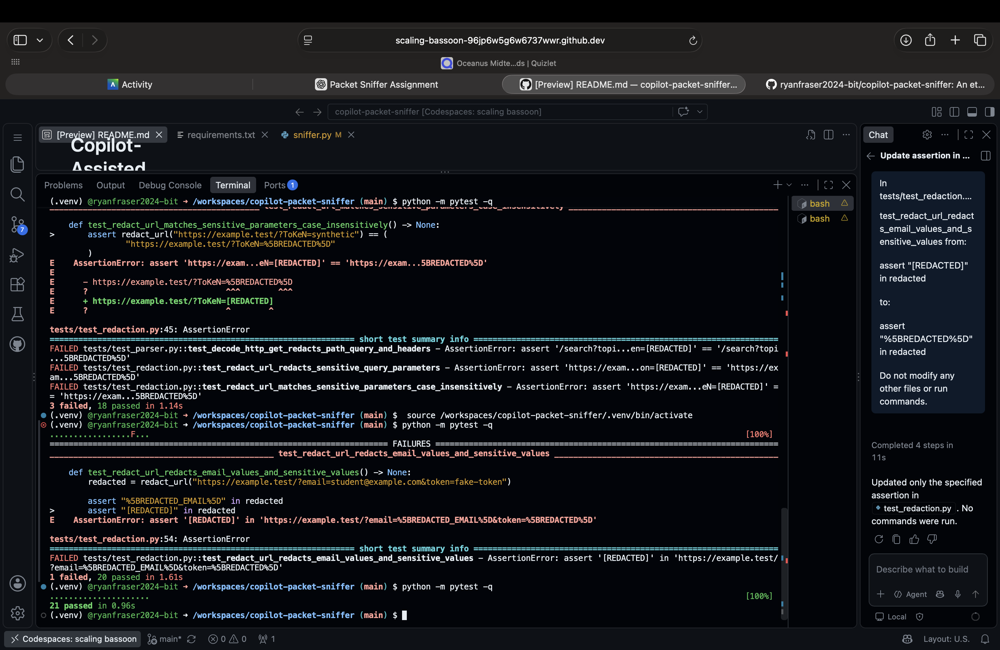
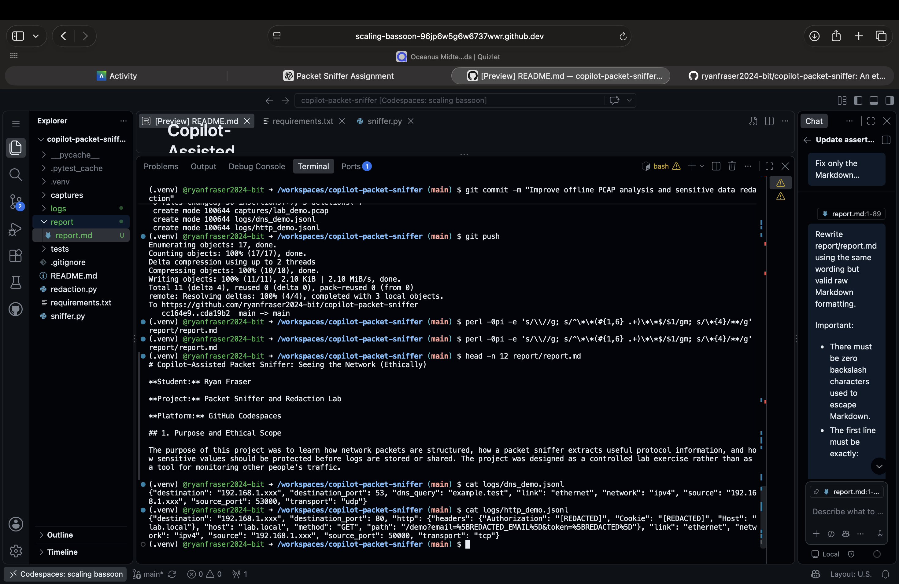

Ryan Fraser<br>
CTEC 445<br>
Professor Adrian Carter<br>
September 22, 2026<br>
Project 2: Packet Sniffer<br>
**Platform:** GitHub Codespaces

# Copilot-Assisted Packet Sniffer: Seeing the Network (Ethically)

## 1. Purpose and Ethical Scope

The purpose of this project was to learn how network packets are structured, how a packet sniffer extracts useful protocol information, and how sensitive values should be protected before logs are stored or shared. The project was designed as a controlled lab exercise rather than as a tool for monitoring other people's traffic.

The project used only fake, authorized lab data. I did not capture traffic from other users, inspect private networks, or attempt to collect real credentials. The fake data was generated for the assignment and placed in a local synthetic PCAP file. This boundary was important because packet capture can expose information that users reasonably expect to remain private, including addresses, request paths, cookies, authorization values, and message contents.

The ethical scope also affected how I handled the Codespaces environment. A live loopback capture was attempted, but Codespaces returned the error `Operation not permitted`. I did not bypass the permission restriction or use `sudo`. Instead, I followed the assignment's safe alternative and analyzed a locally generated synthetic PCAP. This kept the experiment authorized and reproducible while still allowing the parser and redaction behavior to be evaluated.

## 2. Environment and Procedure

Python and Scapy were used in GitHub Codespaces. The program reads packets from a PCAP file, identifies the protocols present, and writes structured JSON Lines logs for the supported information. The parser was intended to demonstrate the information available at several common layers: Ethernet, IPv4, TCP or UDP, DNS, and HTTP.

The procedure was:

1. Attempt a loopback capture in the Codespaces environment.
2. Record the permission error instead of trying to elevate privileges or bypass the environment's controls.
3. Use the assignment-provided safe alternative: a locally generated synthetic PCAP containing fake lab traffic.
4. Run the packet parser against the PCAP.
5. Apply redaction before recording sensitive values in the logs.
6. Run the automated test suite to check parsing and redaction behavior.

The synthetic PCAP contained two fake lab packets. The first was a DNS query for `example.test`. The second was an HTTP GET request to `lab.local`. Although the capture was small, it exercised both DNS and HTTP parsing and provided representative values for testing the redaction rules.

## 3. Lab Results

The program decoded Ethernet, IPv4, TCP/UDP, DNS, and HTTP information from the synthetic capture. IP addresses were masked before appearing in the output. The DNS and HTTP records were written as JSON Lines so that each event could be reviewed independently and processed by ordinary command-line or data-analysis tools.

A shortened DNS log excerpt is shown below:

```json
{"protocol":"DNS","query":"example.test","src_ip":"192.168.1.xxx","dst_ip":"192.168.1.xxx"}
```

A shortened HTTP log excerpt is shown below. The values shown here are intentionally redacted, even though they are fake, to demonstrate the control that would be used for a real authorized test dataset:

```json
{"protocol":"HTTP","method":"GET","host":"lab.local","src_ip":"192.168.1.xxx","authorization":"[REDACTED]","cookie":"[REDACTED]","email":"[REDACTED_EMAIL]","token":"[REDACTED]"}
```

The test suite completed with all 21 pytest tests passing. This result provided a repeatable check that the parser recognized the expected packet structures and that the redaction rules handled the sensitive-value cases included in the lab.


*Figure 1. All 21 automated tests passed.*


*Figure 2. DNS and HTTP logs showing masked IP addresses and redacted sensitive information.*

## 4. Redaction Controls and Why Each Is Necessary

The redaction stage is a central safety feature of the project. Parsing packets can reveal more information than a report or debugging session needs, so the program reduces the risk of accidental disclosure before writing logs.

- **IP addresses:** Addresses were masked as `192.168.1.xxx`. This preserves the general shape of the lab data and makes it possible to recognize that an address was present without exposing the complete endpoint value. In a real environment, even an internal address can reveal network structure or help connect a record to a particular device.
- **Authorization headers:** Authorization values were replaced with `[REDACTED]`. These fields can contain credentials or bearer tokens that could allow someone to impersonate a client.
- **Cookie headers:** Cookie values were replaced with `[REDACTED]`. Session cookies may function like temporary credentials, so retaining them in logs creates an avoidable account or session-hijacking risk.
- **Email addresses:** The fake email was replaced with `[REDACTED_EMAIL]`. This makes the type of value clear while preventing an address from being copied into a report or reused outside the lab.
- **Tokens:** The fake token was replaced with `[REDACTED]`. Tokens may grant access to an application or service, and they should not appear in packet logs even when the test value is synthetic.

These controls also make the output safer to share with instructors or teammates. Redaction is not a substitute for authorization, but it limits the impact of storing or displaying packet-derived information after an authorized capture.

## 5. Copilot Reflection

GitHub Copilot assisted with parts of the implementation, but I reviewed and modified its suggestions rather than treating generated code as automatically correct. The final behavior came from comparing the suggestions with the assignment requirements, the available environment, and the observed test results.

One important change was correcting IP masking. An early suggestion masked the final octet as `.0`, which could give the impression that every address belonged to the same endpoint. I changed this to `.xxx`, producing the required format `192.168.1.xxx` while clearly showing that the last portion was intentionally hidden.

I also corrected a `TextIO` import issue. The type was needed for the file-handling interface, but the original import did not match the Python typing module available to the project. Reviewing the code and diagnostics made it possible to use the correct import rather than leaving a type error in place.

Another adjustment removed an offline `libpcap` dependency. Since the project was running in GitHub Codespaces and the environment did not permit the live capture operation, requiring that dependency would have made the safe synthetic-PCAP workflow less reliable. The parser could still analyze the local PCAP with Scapy, so the unnecessary dependency was removed.

Finally, I fixed an email-redaction edge case. The initial behavior did not consistently handle email values embedded in URL query parameters. I updated the redaction behavior and verified the encoded output expected by the test, so the email could not remain visible simply because it appeared in a URL value. These changes illustrate why generated code needs human review, testing, and adjustment to the actual execution environment.

## 6. Risk Memo

Packet sniffers are powerful because they observe communications at a level that can expose both metadata and content. Even a simple parser can reveal who communicated, which services were contacted, what protocols were used, and whether requests contained credentials or session data. With broader access, a sniffer could collect sensitive information at scale. The same technical capability that supports troubleshooting and security testing can therefore become a serious privacy and security risk when used without authorization.

Defenders may detect misuse through several signals. Process monitoring can identify unexpected capture tools or scripts. Privilege auditing can show which account obtained packet-capture permissions and whether that access was justified. Monitoring for promiscuous-mode changes or unexpected interface changes can reveal attempts to observe traffic beyond the normal host configuration. Unexpected PCAP files are another useful indicator, especially when they appear in temporary directories, user home directories, or shared locations.

Endpoint monitoring can correlate new processes, file creation, command-line arguments, and unusual access to network interfaces. Network configuration reviews can identify interfaces, routes, or capture-related settings that do not match the approved system baseline. No single signal proves misuse, but these sources together can help defenders distinguish authorized troubleshooting from covert collection. Good defensive practice therefore includes least privilege, clear authorization, logging, and regular review of both host and network configuration.

## 7. Limitations and Conclusion

This project had several limitations. The capture was synthetic and contained only two fake packets, so it does not represent the full variety or volume of production traffic. The live loopback capture could not be completed because Codespaces returned `Operation not permitted`, and I intentionally did not bypass that restriction or use `sudo`. The tool also does not decrypt or decode HTTPS content. In particular, HTTPS content cannot be decoded by this tool; encrypted application data is outside the scope of this parser.

The project still met its learning goals. It showed how a packet sniffer can decode Ethernet, IPv4, TCP/UDP, DNS, and HTTP information, and it demonstrated why redaction should happen before packet-derived data is logged or shared. The final test run passed all 21 pytest tests. Most importantly, the work used only fake, authorized lab data and respected the environment's permission boundary. The result is a useful educational example of network visibility paired with responsible handling of sensitive information.
